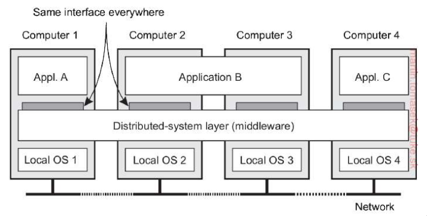
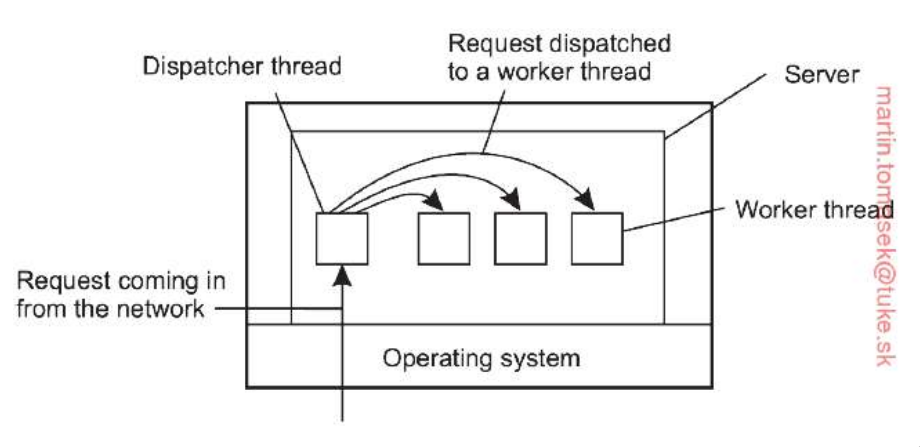

# Čo je to middleware, aká je jeho úloha, na čo slúži v distribuovanom systéme?

-   **Middleware** je samostatná softvérová vrstva, ktorá je logicky
    umiestnená medzi aplikáciami a lokálnymi operačnými systémami
    jednotlivých počítačov v sieti

    

-   V distribuovanom systéme slúži ako spoločné rozhranie, ktoré je
    rovnaké pre všetky stroje a komponenty, čím uľahčuje vývoj
    komplexných aplikácií

-   **Kľúčové aspekty a využitie v distribuovanom systéme:**

    1.  **Dosiahnutie transparentnosti distribúcie:**

        -   skryť fakt, že procesy a zdroje sú fyzicky rozdelené na
            viacerých počítačoch

        -   **middleware** maskuje rozdiely v hardvéri a operačných
            systémoch

        -   pre koncového používateľa a aplikáciu sa vďaka middlewareu
            javí distribuovaný systém ako jeden koherentný celok

    2.  **Manažment zdrojov a komunikácia:**

        -   v distribuovanom systéme plní podobnú úlohu, akú má operačný
            systém v rámci jedného počítača (pôsobí ako manažér zdrojov)

        -   **Komunikácia medzi aplikáciami** - poskytuje mechanizmy na
            výmenu dát medzi procesmi, ktoré by inak museli komunikovať
            na nízkej úrovni transportnej vrstvy, typickým príkladom je
            **RPC (Remote Procedure Call)**, ktorý umožňuje volať
            procedúry na vzdialených strojoch, akoby boli lokálne

        -   **Zdieľanie zdrojov** - umožňuje aplikáciám efektívne
            zdieľať a nasadzovať zdroje v sieťovom prostredí

    3.  **Poskytovanie spoločných služieb:**

        -   implementuje služby, ktoré sú užitočné pre široké spektrum
            aplikácií, čím predchádza tomu, aby ich vývojári museli
            programovať opakovane

        -   **Bezpečnostné služby** - napríklad **autentifikácia
            (overenie identity)** a **autorizácia (kontrola prístupových
            práv)**

        -   **Transakčné spracovanie** - koordinácia distribuovaných
            transakcií pomocou TP monitorov, ktoré zabezpečujú
            vlastnosti ACID (**A**tomicity (atomickosť), **C**onsistency
            (konzistencia), **I**solation (izolácia), **D**urability
            (trvanlivosť))

        -   **Odolnosť voči chybám** - maskovanie zlyhaní a mechanizmy
            na zotavenie z porúch

        -   **Adresárové služby** - napríklad vyhľadávanie sieťových
            adries podľa mena (DNS)

    4.  **Adaptabilita a organizácia:**

        -   **Integrácia podnikových aplikácií (Enterprise Application
            Integration - EAI)** - umožňuje prepojiť existujúce (legacy)
            systémy, ktoré by inak neboli schopené spolupráce, často
            pomocou tzv. správcov správ (message brokers), ktorí
            transformujú dáta do formátu zrozumiteľného pre cieľovú
            aplikáciu

    5.  **Integrácia systémov (EAI):**

        -   aby bol middleware otvorený a prispôsobiteľný potrebám
            aplikácií, využíva rôzne návrhové vzory

        -   **Wrappery (obaly)** - špeciálne komponenty, ktoré riešia
            nekompatibilitu rozhraní starších aplikácií

        -   **Interceptory (zachytávače)** - softvérové konštrukty,
            ktoré umožňujú prerušiť bežný tok riadenia a spustiť
            špecifický kód aplikácie, čím sa middleware prispôsobuje
            potrebám aplikácie

# Načrtnite návrh viacvláknového servera, ktorý podporuje viacero aplikačných protokolov používajúci sockety ako rozhranie transportnej vrstvy nad operačným systémom

-   Pre dosiahnutie paralelizmu a efektívneho spracovania požiadaviek je
    kľúčové použiť viacvláknový model, konkrétne organizáciu typu
    **Dispatcher/Worker**

    -   **Dispatcher thread** - vlákno zodpovedné za čítanie
        prichádzajúcich požiadaviek zo siete, v prípade podpory
        viacerých protokolov dispečer monitoruje viacero sieťových
        rozhraní súčasne

    -   **Worker threads** - po prijatí požiadavky dispečer vyberie
        voľné pracovné vlákno, ktorému prácu odovzdá, vlákna vykonávajú
        samotnú aplikačnú logiku

-   **Podpora viacerých aplikačných protokolov:**

    -   Server musí byť schopný rozlišovať medzi rôznymi protokolmi
        (napr. HTTP, SMTP, FTP), ktoré sa nachádzajú v aplikačnej vrstve

    -   **Koncové body (End points/Ports)** - každý aplikačný protokol
        je zvyčajne priradený ku konkrétnemu portu (koncovému bodu) nad
        transportnou vrstvou

    -   **Rozhranie transportnej vrstvy** - aplikačné protokoly
        komunikujú s transportnou vrstvou (TCP/UDP) cez sockety

# Ako spraviť aby server ktorý má viac vlákien akceptoval správy z rôznych protokolov?

-   Na to, aby server s viacerými vláknami dokázal akceptovať správy z
    rôznych protokolov, sa v distribuovaných systémoch využívajú
    kombinácie nasledujúcich prístupov:

    1.  **Využitie superservera a viacerých koncových bodov:**

        -   efektívnym riešením je využitie tzv. superservera, ktorý
            namiesto udržiavania mnohých pasívnych procesov pre každú
            službu počúva na viacerých koncových bodoch (portoch)
            súčasne

        -   každý port je priradený inej službe alebo protokolu (napr.
            port 21 pre FTP, port 80 pre HTTP)

        -   keď príde požiadavka na konkrétny port, superserver vytvorí
            (v rozdvojenom procese alebo vlákne) inštanciu špecifického
            servera určeného pre daný protokol, ktorý požiadavku
            spracuje

    2.  **Model Dispatcher/Worker:**

        -   v rámci viacvláknovej architektúry servera figuruje vlákno
            odosielateľa (dispatcher thread), ktorého úlohou je čítať
            prichádzajúce požiadavky zo siete

        -   dispatcher následne vyberie a pridelí prácu príslušnému
            pracovnému vláknu (worker thread)

        -   ak je server navrhnutý na podporu viacerých protokolov,
            dispatcher môže prijímať správy z rôznych komunikačných
            kanálov a delegovať ich na vlákna, ktoré ovládajú logiku
            konkrétneho protokolu

    3.  **Implementácia sprostredkovateľa správ (Message Broker):**

        -   ak aplikácie používajú odlišné formálne protokoly a formáty
            správ, do architektúry sa vkladá message broker

        -   funguje ako brána na aplikačnej úrovni, ktorá konvertuje a
            preformátuje prichádzajúce správy tak, aby boli zrozumiteľné
            pre cieľovú aplikáciu servera

        -   broker tak umožňuje serveru nepriamo prijímať správy z
            protokolov, ktoré sám natívne nepodporuje

    4.  **Využitie wrapperov:**

        -   **Wrapper** je špeciálny komponent, ktorý poskytuje
            akceptovateľné rozhranie pre server a rieši problém
            nekompatibility medzi rozhraniami klienta a servera

        -   jeden server môže obsahovať viacero wrapperov súčasne,
            pričom každý z nich môže podporovať iné pravidlá (activation
            policies) a protokoly pre prístup k objektom

    5.  **Využitie interceptorov:**

        -   Middleware môže byť prispôsobený potrebám konkrétnych
            aplikácií a protokolov pomocou interceptorov (zachytávačov)

        -   Interceptor je softvérový konštrukt, ktorý preruší bežný tok
            riadenia a umožní spustiť špecifický kód na spracovanie
            požiadavky na rôznych úrovniach (napr. na úrovni správy
            alebo požiadavky), čo uľahčuje obsluhu viacerých
            komunikačných štandardov

# Predpokladajme, že v sieťovom podsystéme môžete používať iba blokujúce operácie priebežnej synchrónnej komunikácie. Popíšte ako by ste pomocou týchto synchrónnych operácií implementovali nové neblokujúce operácie priebežnej asynchronnej komunikácie?

-   **Využitie viacvláknového spracovania (Multithreading):**

    -   Najčastejším spôsobom, ako skryť latenciu blokujúcich volaní, je
        použitie viacerých vlákien v rámci jedného procesu

    -   **Princíp** - hlavné vlákno aplikácie, ktoré potrebuje odoslať
        správu, nevykoná blokujúce volanie priamo, namiesto toho vytvorí
        nové pracovné vlákno (alebo priradí úlohu vláknu z fondu
        vlákien), ktoré vykoná blokujúcu synchrónnu operáciu

    -   **Výsledok** - zatiaľ čo je pracovné vlákno zablokované a čaká
        na dokončenie prenosu alebo potvrdenie od príjemcu, hlavné
        vlákno môže okamžite pokračovať v inej činnosti

    -   **Spracovanie výsledku** - keď blokujúca operácia v pracovnom
        vlákne skončí, aplikácia môže byť informovaná prostredníctvom
        spätného volania (callback) alebo upcallu, čím sa signalizuje
        výskyt udalosti (napr. doručenie odpovede)

-   **Implementácia vyrovnávacej pamäte v rámci middlewaru:**

    -   Neblokujúca komunikácia sa dá dosiahnuť vložením vrstvy
        middlewaru, ktorá poskytuje dočasné úložisko (storage
        facility/buffer)

    -   **Princíp** - odosielajúca aplikácia odovzdá správu middlewaru,
        pre aplikáciu sa táto operácia javí ako okamžitá (neblokujúca),
        pretože middleware správu ihneď uloží do svojej lokálnej fronty

    -   **Mechanizmus na pozadí** - middleware následne na pozadí
        použije blokujúce synchrónne operácie na skutočný prenos správy
        k príjemcovi

-   **Asynchrónne RPC s okamžitým potvrdením (ACK):**

    -   Tento prístup mení sémantiku synchrónneho volania na úrovni
        protokolu, aby sa dosiahol asynchrónny efekt

    -   **Princíp** - synchrónna operácia je navrhnutá tak, že
        odosielateľ je blokovaný iba dovtedy, kým nedostane okamžité
        potvrdenie (acknowledgement) od servera alebo middlewaru, že
        požiadavka bola prijatá

    -   **Výsledok** - hoci je volanie technicky blokujúce, blokovanie
        trvá len minimálny čas potrebný na prenos správy a prijatie ACK,
        nie na samotné spracovanie úlohy na strane servera, po prijatí
        ACK odosielateľ pokračuje a výsledok spracovania mu môže byť
        doručený neskôr (napr. v rámci odloženého synchrónneho RPC)

-   **Model konečného automatu:**

    -   **Princíp** - proces nečaká v blokovanom stave, ale zakaždým,
        keď potrebuje vykonať operáciu, ktorá by inak blokovala,
        zaznamená si svoj aktuálny stav a vráti riadenie plánovaču

    -   **Reakcia na udalosti** - aplikácia je štruktúrovaná tak, že
        reaguje na prichádzajúce udalosti (napr. „sieť je pripravená na
        zápis"), čím simuluje paralelizmus aj pri použití blokujúcich
        systémových volaní

# Predpokladajme, že by ste mohli použiť iba neblokujúce asynchrónne komunikačné opreácie na posielanie a prijímanie správ. Ako by ste implementovali operácie blokujúcej synchrónnej komunikácie pomocou týchto asynchrónnych operácií?

-   **Implementácia pomocou dopytovania (Polling):**

    -   Najjednoduchším spôsobom, ako simulovať blokovanie pomocou
        neblokujúcich operácií, je použitie cyklu dopytovania
        (busy-waiting)

    -   **Blokujúce prijímanie (Blocking Receive)** - aplikácia v cykle
        opakovane volá neblokujúcu operáciu prijímania, ktorá okamžite
        vráti informáciu, či správa prišla alebo nie, cyklus beží
        dovtedy, kým neblokujúca operácia skutočne nevráti prijatú
        správu

    -   **Blokujúce odosielanie (Blocking Send)** - odosielateľ použije
        asynchrónne odoslanie a následne vstúpi do cyklu, v ktorom čaká
        na príchod asynchrónnej potvrdzujúcej správy (ACK) od príjemcu
        alebo middleware-u, tým sa simuluje stav, v ktorom proces nemôže
        pokračovať, kým nemá istotu o doručení

-   **Použitie stavového automatu (Finite State Machine):**

    -   **Princíp** - v momente, kedy je potrebné vykonať „blokujúcu"
        operáciu, proces si uloží svoj aktuálny stav a spustí
        neblokujúce odoslanie/prijímanie, proces sa následne prepne do
        stavu „čakanie"

    -   **Výsledok** - až po prijatí udalosti o dokončení operácie
        (napr. cez asynchrónny callback alebo príchod správy) sa proces
        vráti k pôvodnej úlohe a pokračuje z bodu, kde skončil

-   **Využitie viacvláknového spracovania (Multithreading):**

    -   Viacvláknovosť umožňuje skryť asynchrónnu povahu komunikácie
        pred zvyškom aplikácie

    -   **Princíp** - vytvorí sa samostatné vlákno, ktoré vykoná
        asynchrónne volanie a následne sa „zablokuje" (napr. čakaním na
        synchronizačnú premennú -- mutex alebo semafor), kým operácia
        neskončí

    -   **Výsledok** - z pohľadu hlavného programu sa toto volanie javí
        ako blokujúce, hoci na nižšej úrovni sa stále využívajú
        asynchrónne operácie

-   **Explicitné potvrdzovanie (Acknowledgment):**

    -   Pre dosiahnutie synchrónneho správania v asynchrónnom modeli je
        nevyhnutné zaviesť **protokol potvrdzovania**

    -   **Synchronizácia pri odoslaní** - odosielateľ je blokovaný
        (pomocou vyššie uvedených metód), kým asynchrónne neprijme
        správu od middleware-u, že ten prevzal zodpovednosť za prenos

    -   **Synchronizácia po spracovaní** - ide o princíp Remote
        Procedure Call (RPC), kde klient pošle asynchrónnu požiadavku a
        „blokuje sa" až do momentu, kedy mu server asynchrónne pošle
        odpoveď s výsledkom

# Nech klient volá asynchrónnym RPC server a súčasne čaká, kým server nevráti odpoveď pomocou iného asynchrónneho RPC volania. Vysvetlite, či je tento prístup rovnaký ako nechať klienta volať normálne RPC. Čo by sa stalo, ak nahradíme asynchrónne RPC volania jednosmernými (one-way) RPC volaniami?

-   **Tento prístup nie je rovnaký ako volanie normálneho (synchrónneho)
    RPC**

-   **Porovnanie s normálnym RPC:**

    -   Hoci sa v oboch prípadoch klientska aplikácia nakoniec dozvie
        výsledok, mechanizmus a sémantika správania sú odlišné

    -   **Jednosmerné RPC** - vo svojej podstate synchrónne, keď klient
        zavolá vzdialenú procedúru, jeho proces je pozastavený
        (blokovaný) a čaká, kým server nevykoná prácu a nevráti odpoveď,
        programátor vníma volanie ako lokálne a celá komunikácia je pre
        neho transparentná

    -   **Kombinácia asynchrónnych RPC** - tento prístup sa označuje ako
        odložené synchrónne RPC (deferred synchronous RPC), pri prvom
        asynchrónnom volaní server pošle klientovi okamžite iba
        potvrdenie (ACK) o prijatí požiadavky, po ktorom klient
        pokračuje v činnosti (nie je blokovaný vykonávaním procedúry na
        serveri), samotný výsledok doručí server neskôr prostredníctvom
        spätného volania (callback), čo je v podstate ďalšie asynchrónne
        RPC volanie smerom ku klientovi

-   **Nahradenie jednosmernými (one-way) RPC volaniami:**

    -   Ak by sme asynchrónne volania nahradili jednosmernými RPC,
        správanie systému by sa zmenilo nasledovne:

    -   **Absencia potvrdenia (ACK)** - pri asynchrónnom RPC klient čaká
        aspoň na ACK od servera, že požiadavka dorazila, pri one-way RPC
        klient odošle správu a pokračuje okamžite bez akéhokoľvek
        čakania na potvrdenie zo strany servera

    -   **Strata spoľahlivosti** - pri jednosmernom RPC volaní nie je
        zaručená spoľahlivosť doručenia, klient nemá žiadnu vedomosť o
        tom, či server jeho požiadavku vôbec prijal alebo či ju
        spracoval

    -   **Škálovateľnosť** - jednosmerné RPC oslabujú väzbu medzi
        klientom a serverom, čo vedie k lepšej škálovateľnosti, a preto
        sú typické pre prostredia ako cloud computing

    -   **Doručenie výsledku** - ak by aj server poslal výsledok späť
        pomocou one-way RPC, klient by opäť nemal ako potvrdiť jeho
        prijatie. Celá komunikácia by sa tak podobala skôr na čistú
        výmenu správ (messaging) než na tradičné volanie procedúr

# Je striktne nutné potvrdiť prijatie každej správy, aby sme dosiahli plne usporiadaný multicast pomocou Lamportových časových značiek? Odpoveď zdôvodnite

-   **Áno, je to striktne nutné**

-   **Odôvodnenie:**

    -   **Mechanizmus zoradenia** - pri plne usporiadanom multicaste
        (total-ordered multicasting) si každý proces udržiava lokálny
        front správ, ktoré sú zoradené podľa ich časových značiek
        (timestampov)

    -   **Podmienka doručenia aplikácii** - správa, ktorá príde do
        systému, nemôže byť aplikácii doručená okamžite, správa sa
        doručí aplikácii až vtedy, keď sú splnené dve podmienky:

        1.  správa sa nachádza na čele lokálneho frontu

        2.  prijatie tejto správy bolo potvrdené každým ďalším procesom
            v skupine

    -   **Úloha potvrdení (ACK)** - keď proces prijme správu,
        multicastuje potvrdenie (acknowledgment) všetkým ostatným členom
        skupiny, Lamportov algoritmus zabezpečuje, že časová značka
        tohto potvrdenia je vždy vyššia ako časová značka pôvodnej
        prijatej správy

    -   **Zaručenie poradia** - prijatie potvrdení od všetkých ostatných
        procesov je nevyhnutné preto, aby mal daný proces istotu, že do
        systému už nepríde žiadna iná správa s nižšou časovou značkou,
        ktorá by v poradí musela predbehnúť správu na čele frontu

    -   **Dosiahnutie konzistencie** - až po získaní všetkých potvrdení
        je zaručené, že všetky procesy majú identickú kópiu lokálneho
        frontu a doručia správy v presne rovnakom poradí, čím sa
        dosiahne plné usporiadanie (total order)

# Vysvetlite prečo úplne usporiadaný multicast používajúci Lamportové logické hodiny nie je dobre škálovateľný?

-   **Úplne usporiadaný multicast (total-ordered multicast) využívajúci
    Lamportove logické hodiny** nie je dobre škálovateľný predovšetkým
    kvôli vysokej komunikačnej réžii a potrebe globálnej synchronizácie
    všetkých zúčastnených procesov

-   **Hlavné dôvody nízkej škálovateľnosti sú:**

    -   **Nadmerné množstvo správ** - pri tomto algoritme musí každý
        proces, ktorý prijme multicastovú správu, odoslať potvrdenie
        (acknowledgment) všetkým ostatným procesom v skupine, čo pri
        zvyšujúcom sa počte uzlov rýchlo zahltí sieť

    -   **Čakanie na potvrdenia (Synchronizačné úzke hrdlo)** - správa
        je doručená aplikácii až vtedy, keď sa nachádza na čele
        lokálneho frontu a zároveň bola potvrdená každým jedným procesom
        v skupine, to znamená, že rýchlosť doručovania správ v celom
        systéme je limitovaná najpomalším článkom alebo procesom s
        najväčšou latenciou

    -   **Citlivosť na zlyhanie (N bodov zlyhania)** - ak hoci len jeden
        proces v skupine zlyhá alebo prestane odpovedať, systém nemôže
        prijať jeho potvrdenie, keďže správy na čele frontu čakajú na
        potvrdenie od všetkých, zlyhanie jediného uzla môže zablokovať
        doručovanie všetkých nasledujúcich správ v celom distribuovanom
        systéme

    -   **Nákladnosť globálneho usporiadania** - garantovanie jednotného
        poradia všetkých operácií všade v systéme je vo svojej podstate
        nákladná operácia, ktorá prirodzene znižuje výkon a
        škálovateľnosť

# Porovnajte externé a interné DSL, ich vlastnosti, výhody a nevýhody ich aplikácie

-   **Koncept Lamportových logických hodín:**

    -   Lamportove logické hodiny nie sú v skutočnosti „hodinami" v
        zmysle merania fyzického času, ale predstavujú monotónne rastúce
        počítadlá, ktoré slúžia na usporiadanie udalostí v
        distribuovanom systéme

    -   Základom je relácia „stalo sa pred" (happened-before), označená
        ako a→b, čo znamená, že všetky procesy sa zhodnú na tom, že
        udalosť a nastala skôr ako udalosť b

    -   Táto relácia je tranzitívna (ak a→b a b→c, potom a→c) a platí,
        že odoslanie správy vždy predchádza jej prijatiu

    -   **Lamportov algoritmus funguje nasledovne:**

        1.  Pred vykonaním akejkoľvek udalosti (operácie) proces $P_i$
            inkrementuje svoje lokálne počítadlo: $C_i$←$C_i$+1

        2.  Pri odosielaní správy m jej proces priradí časovú pečiatku
            rovnú aktuálnej hodnote svojho počítadla: ts(m) = $C_i$

        3.  Pri prijatí správy m proces $P_j$ upraví svoje počítadlo
            podľa vzorca: $C_j$ = max$C_j$, ts(m), následne ho
            inkrementuje a doručí správu aplikácii

-   **Úplne usporiadané skupinové vysielanie (Total-ordered
    multicasting):**

    -   **Lamportove hodiny sa tu využívajú nasledovne:**

    -   **Vysielanie** - každá správa je označená časovou pečiatkou
        aktuálneho logického času odosielateľa a je poslaná všetkým
        členom skupiny (vrátane odosielateľa)

    -   **Lokálny front** - prijímací proces zaradí správu do svojho
        lokálneho frontu, ktorý je usporiadaný podľa časových pečiatok
        správ

    -   **Potvrdenie (ACK)** - prijímateľ odošle potvrdenie o prijatí
        (multicast ACK) všetkým ostatným procesom

    -   **Doručenie aplikácii** - správa je doručená aplikácii až vtedy,
        keď je na čele frontu a zároveň bola potvrdená každým ďalším
        procesom v skupine

    -   Vďaka vlastnostiam Lamportovho algoritmu budú mať všetky procesy
        nakoniec identickú kópiu frontu, čím sa dosiahne rovnaké poradie
        doručenia všade

-   **Vektorové hodiny a zachytenie kauzality:**

    -   Hlavným problémom Lamportových hodín je, že z časových pečiatok
        nie je možné určiť kauzálnu súvislosť -- ak C(e)\<C(e'),
        neznamená to nevyhnutne, že e kauzálne predchádza e' (udalosti
        môžu byť konkurentné), tento nedostatok riešia vektorové hodiny

    -   Vektorové hodiny $VC_i$ procesu $P_i$ sú pole (vektor) logických
        hodín všetkých procesov

    -   Index $VC_i$\[i\] predstavuje počet udalostí na vlastnom procese
        a $VC_i[j]$ predstavuje vedomosť procesu $P_i$ o počte udalostí,
        ktoré nastali na procese $P_j$

    -   **Zachytávanie kauzality a vynútenie poradia** - aby sa
        zabezpečilo kauzálne usporiadanie, proces $P_j$ pri prijatí
        správy od $P_i$ s vektorovou pečiatkou ts(m) odloží jej
        doručenie, kým nie sú splnené dve podmienky:

        1.  $ts(m)[i] = VC_j[i] + 1$: Ide o nasledujúcu správu v poradí
            od odosielateľa $P_i$ (žiadna mu nechýba)

        2.  $ts(m)[k] \leq VC_j[k]$ pre všetky $k \neq i$: Prijímateľ
            $P_j$ už doručil všetky správy, ktoré videl odosielateľ
            $P_i$ predtým, než poslal správu m

    -   Týmto spôsobom vektorové hodiny presne zachytávajú závislosti
        medzi správami a zabezpečujú, že žiadna správa nie je doručená
        skôr, než správy, ktoré jej príčinne (kauzálne) predchádzali

# Vysvetlite dôvod zavedenia konzistencie zameranej na klienta v distribuovanom systéme a uveďte konkrétne konzistentné modely. Uvažujme nad službou poštovej schránky pre mobilného používateľa, ktorá je implementovaná ako súčast rozsiahlej distribuovanej databázy. Ktorý konzistentný model zameraný na klienta by bol najvhodnejší? Odpoveď zdôvodnite

-   Dôvodom zavedenia konzistencie zameranej na klienta (client-centric
    consistency) v distribuovaných systémoch je skutočnosť, že modely
    zamerané na dáta (data-centric) sú často náročné na výkon a globálnu
    synchronizáciu

-   Eventuálne konzistentné modely (eventual consistency) fungujú dobre,
    pokiaľ klient pristupuje stále k tej istej replike, avšak problémy
    nastávajú, keď mobilný používateľ v krátkom čase pristupuje k rôznym
    replikám distribuovanej databázy

-   Tieto nové repliky nemusia obsahovať posledné aktualizácie vykonané
    používateľom, čo vedie k inkonzistentnému pohľadu na dáta z
    perspektívy daného klienta

-   Konzistencia zameraná na klienta teda poskytuje záruky pre jedného
    konkrétneho používateľa, aby pri prístupe cez rôzne repliky videl
    dáta v logickom a očakávanom stave

-   **Rozlišujeme štyri konkrétne modely konzistencie zameranej na
    klienta (client-centric consistency):**

    1.  **Monotónne čítanie (Monotonic Reads)** - ak proces načíta
        hodnotu položky x, každá následná operácia čítania x tým istým
        procesom vráti rovnakú alebo novšiu hodnotu

    2.  **Monotónne zápisy (Monotonic Writes)** - operácia zápisu na
        položku x musí byť dokončená predtým, než ten istý proces vykoná
        akýkoľvek následný zápis na tú istú položku

    3.  **Čítanie vlastných zápisov (Read Your Writes)** - Účinok
        operácie zápisu procesom na položku x sa vždy prejaví pri
        následnej operácii čítania položky x tým istým procesom

    4.  **Zápisy nasledujú čítania (Writes Follow Reads)** - Operácia
        zápisu procesom na položku x, ktorá nasleduje po predchádzajúcom
        čítaní tej istej položky, sa zaručene uskutoční na rovnakej
        alebo novšej hodnote položky x, aká bola načítaná

-   Pre službu poštovej schránky pre mobilného používateľa by bol
    najvhodnejší model **Monotónne čítanie (Monotonic Reads)** v
    kombinácii s modelom **Čítanie vlastných zápisov (Read Your
    Writes)**

-   **Čítanie vlastných zápisov** - kľúčové preto, lebo ak používateľ v
    poštovej schránke vykoná zmenu (napr. odošle e-mail alebo vymaže
    správu -- zápis), očakáva, že pri ďalšom otvorení zoznamu správ
    (čítanie) uvidí tento úkon už prejavene, bez tohto modelu by sa
    mohlo stať, že po vymazaní správy na jednej replike a následnom
    presune k inej replike by sa vymazaná správa používateľovi znova
    objavila

-   **Monotónne čítanie** - zabezpečuje, že ak si používateľ raz prezrie
    obsah svojej schránky, pri ďalšom obnovení zoznamu (aj po pripojení
    k inej replike) sa mu schránka nezobrazí v staršom stave, v akom
    bola napríklad pred hodinou, to garantuje, že používateľ nikdy
    neuvidí „návrat v čase" pri prechádzaní medzi rôznymi prístupovými
    bodmi distribuovanej databázy

# Vysvetlite problém konzistencie zameranej na údaje v distribuovanom systéme a uveďte konkrétne konzistenčné modely založené na usporadúvaní operácií. Aký je význam použitia modelu konečnej konzistencie (eventual consistency model) v praktických aplikáciách na rozdiel od silnejších modelov?

-   **Konzistencia zameraná na údaje (data-centric consistency)** - v
    distribuovanom systéme predstavuje formu zmluvy medzi procesmi a
    distribuovaným úložiskom údajov, táto zmluva presne špecifikuje, aké
    výsledky majú operácie čítania a zápisu v prostredí, kde dochádza k
    súbežnému prístupu k replikovaným údajom

-   **Problém konzistencie zameranej na údaje**

    -   Hlavným problémom pri replikácii údajov (ktorá sa robí kvôli
        zvýšeniu spoľahlivosti a výkonu) je udržiavanie konzistencie
        replík

    -   **Pri súbežnom prístupe vznikajú konfliktné operácie:**

        -   **Read-write konflikt** - operácia čítania a operácia zápisu
            prebiehajú súčasne

        -   **Write-write konflikt** - dve operácie zápisu prebiehajú
            súčasne

    -   Zabezpečenie globálneho usporiadania týchto operácií na všetkých
        replikách je nákladné a negatívne ovplyvňuje škálovateľnosť
        systému

-   **Konzistenčné modely založené na usporadúvaní operácií**

    -   Tieto modely (označované aj ako modely silnej konzistencie)
        nepoužívajú explicitné synchronizačné operácie (ako zámky), ale
        definujú pravidlá pre **poradie vykonávaných operácií**

        -   **Striktná konzistencia (Strict consistency)** - akákoľvek
            operácia čítania vráti hodnotu výsledku poslednej operácie
            zápisu bez ohľadu na to, kde v systéme k zápisu došlo,
            všetky zápisy sú okamžite viditeľné pre všetky procesy, čo
            si vyžaduje absolútny globálny čas

        -   **Sekvenčná konzistencia (Sequential consistency)** -
            výsledok vykonávania je rovnaký, akoby operácie všetkých
            procesov boli vykonávané v nejakom sekvenčnom poradí, pričom
            operácie každého jednotlivého procesu sa v tejto sekvencii
            objavujú v poradí určenom jeho programom, všetky procesy
            musia vidieť rovnaké poradie preložených operácií

        -   **Kauzalna konzistencia (Causal consistency)** - je
            oslabením sekvenčnej konzistencie, vyžaduje, aby zápisy,
            ktoré sú potenciálne kauzálne súvisiace, videli všetky
            procesy v rovnakom poradí, súbežné zápisy (ktoré nie sú
            kauzálne prepojené) však môžu rôzne stroje vidieť v rôznom
            poradí

-   **Význam modelu konečnej konzistencie (Eventual Consistency)**

    -   Model konečnej konzistencie (eventual consistency) je slabý
        konzistenčný model, ktorý sa používa v systémoch s obmedzenou
        formou súbežnosti (napr. veľa čítaní, málo zápisov)

    -   **Význam v praktických aplikáciách:**

        -   **Škálovateľnosť a výkon** - na rozdiel od silných modelov,
            ktoré vyžadujú nákladnú globálnu synchronizáciu, model
            konečnej konzistencie umožňuje vykonávať aktualizácie
            „lenivým" spôsobom, ak sa do systému dlhší čas neodošlú
            žiadne aktualizácie, všetky repliky sa postupne stanú
            identickými

        -   **Vysoká dostupnosť** - podľa vety CAP nemôže sieťový systém
            poskytovať súčasne konzistenciu (v zmysle striktnej kópie),
            dostupnosť a odolnosť voči rozdeleniu siete, praktické
            aplikácie v cloude (e-shopy, sociálne siete, CDN)
            uprednostňujú dostupnosť a výkon pred okamžitou
            konzistenciou

        -   **Tolerancia nekonzistencie** - mnohé globálne aplikácie
            tolerujú vysoký stupeň dočasnej nekonzistencie výmenou za
            rýchlu odozvu pre používateľa, ak dôjde ku konfliktu, systém
            ho nahlási alebo vyhlási jeden zápis za „víťaza"

-   V súhrne, kým silné modely sú nevyhnutné pre kritické systémy (napr.
    bankové transakcie s ACID vlastnosťami), model konečnej konzistencie
    je kľúčový pre moderné distribuované služby veľkého rozsahu, kde by
    globálna synchronizácia spôsobila neprijateľné oneskorenia

# Majme distribuovaný systém, ktorý podporuje replikáciu objektov, v ktorej sú všetky volania metód úplne usporiadané. Predpokladajme tiež, že volanie objektu je atomické (napr. pretože každý objekt je pri volaní svojej metódy automaticky uzamknutý). Poskytuje takýto systém vstupnú konzistenciu? A čo sekvenčná konzistencia?

-   Opísaný systém, ktorý využíva úplné usporiadanie volaní a atomicitu
    operácií, poskytuje oba spomínané modely konzistencie, pričom
    sekvenčná konzistencia predstavuje v tomto prípade silnejšiu záruku.

-   **Sekvenčná konzistencia**

    -   Tento systém poskytuje sekvenčnú konzistenciu, podľa definície v
        zdrojoch je sekvenčná konzistencia splnená vtedy, ak výsledok
        akéhokoľvek vykonávania operácií (čítania a zápisu) všetkými
        procesmi v dátovom úložisku zodpovedá nejakému sekvenčnému
        poradiu a operácie každého jednotlivého procesu sa v tomto
        poradí objavujú v poradí určenom jeho programom

    -   **Úplné usporiadanie (Total ordering)** - zabezpečuje, že všetky
        repliky objektov spracujú volania metód v presne rovnakom
        poradí, to znamená, že všetky procesy uvidia rovnaké prelievanie
        (interleaving) operácií

    -   **Atomicita volaní** - predpoklad, že volanie je atomické (napr.
        kvôli automatickému uzamknutiu), zaručuje, že operácie sa nebudú
        navzájom prekrývať nepredvídateľným spôsobom

    -   Vďaka tomu, že sú všetky operácie spracované v identickom poradí
        na všetkých uzloch, systém spĺňa podmienku, že všetky procesy
        vidia rovnakú postupnosť zmien stavu objektov

-   **Vstupná konzistencia (Entry consistency)**

    -   Tento systém poskytuje aj vstupnú konzistenciu, vstupná
        konzistencia patrí medzi modely slabej konzistencie, kde k
        synchronizácii dochádza len vtedy, keď sú zdieľané údaje
        uzamykané a odomykané pomocou synchronizačných premenných
        (operácie Acquire a Release)

    -   **Automatické uzamykanie** - v uvedenom scenári je každý objekt
        pri volaní svojej metódy automaticky uzamknutý, to priamo
        korešponduje s požiadavkou vstupnej konzistencie, kde získanie
        zámku (Acquire) môže byť úspešné len vtedy, ak boli dokončené
        všetky predchádzajúce aktualizácie pridružených údajov

    -   **Vzťah modelov** - keďže sekvenčná konzistencia je model silnej
        konzistencie a vstupná konzistencia je model slabej
        konzistencie, systém, ktorý implementuje mechanizmy pre
        silnejšiu sekvenčnú konzistenciu (najmä atomicitu a globálne
        poradie), prirodzene spĺňa aj kritériá pre slabšie modely
        založené na zámkoch

-   Systém s úplným usporiadaním a atomickými volaniami (cez zámky)
    poskytuje sekvenčnú konzistenciu, pretože všetky repliky prechádzajú
    rovnakými stavmi v rovnakom poradí, zároveň tým, že využíva
    uzamykanie objektov, spĺňa aj podmienky pre vstupnú konzistenciu,
    ktorá garantuje konzistentný pohľad na dáta pri vstupe do kritickej
    sekcie (volanie metódy)

# Majme neblokujúci primary-backup protokol pre zabezpečenie sekvenčnej konzistencie v distribuovanom systéme. Poskytuje takýto distribuovaný systém vždy read-your-writes konzistenciu? Svoju odpoveď zdvôvodnite

-   **Odpoveď** - nie, takýto systém neposkytuje vždy read-your-writes
    konzistenciu

-   **Definície konzistenčných modelov**

    -   **Sekvenčná konzistencia** - vyžaduje, aby výsledok akéhokoľvek
        vykonávania operácií bol taký, ako keby všetky operácie (čítania
        aj zápisy) všetkých procesov prebehli v nejakom sekvenčnom
        poradí, pričom operácie každého jednotlivého procesu sa v tomto
        poradí musia objaviť tak, ako ich určil jeho program

    -   **Read-your-writes konzistencia** - klientsky orientovaný model,
        ktorý zaručuje, že ak proces vykoná operáciu zápisu na dátovú
        položku x, akákoľvek jeho následná operácia čítania na tej istej
        položke x vždy uvidí účinok tohto predchádzajúceho zápisu

-   **Mechanizmus neblokujúceho primary-backup protokolu**

    -   V primary-backup protokole (protokol s primárnym serverom)
        všetky operácie zápisu smerujú na jeden vyhradený primárny
        server, ten následne propaguje aktualizácie na záložné servery
        (backupy)

    -   Neblokujúci (asynchrónny) charakter protokolu znamená, že
        primárny server potvrdí klientovi úspešné dokončenie zápisu
        (odoslaním ACK) ihneď po lokálnom vykonaní operácie, bez toho,
        aby čakal na potvrdenie od všetkých záložných replík, že
        aktualizáciu prijali a spracovali

-   **Prečo dochádza k porušeniu read-your-writes konzistencie**

    -   Hoci primárny server zabezpečuje celkové poradie operácií (čo
        môže stačiť pre sekvenčnú konzistenciu v určitých
        konfiguráciách), problém nastáva v momente, keď sa **klient
        pohybuje alebo pristupuje k rôznym replikám:**

        -   **Zápis** - klient zapíše novú hodnotu do položky x na
            primárnom serveri. Primárny server zápis vykoná a okamžite
            pošle klientovi potvrdenie o úspechu (neblokujúci prístup)

        -   **Propagácia** - aktualizácia záložných serverov prebieha na
            pozadí a môže trvať určitý čas kvôli sieťovému oneskoreniu

        -   **Čítanie** - ten istý klient sa následne pokúsi prečítať
            hodnotu položky x, ale jeho požiadavka je smerovaná na
            záložný server, ktorý ešte nestihol prijať asynchrónnu
            aktualizáciu z primárneho servera

        -   **Výsledok** - klient dostane starú hodnotu, ktorú mal
            záložný server pred jeho posledným zápisom

-   **Tento scenár priamo porušuje pravidlo read-your-writes
    konzistencie, pretože klient nevidí výsledok svojho vlastného
    predchádzajúceho zápisu**

-   Na dosiahnutie tejto záruky v takomto systéme by bolo potrebné, aby
    klient-centrický softvér buď vynútil čítanie z primárneho servera,
    alebo pred čítaním zo záložného servera overil, či už daná replika
    videla všetky zápisy z klientovho \"write set-u\"

# Vysvetlite čo je to konsenzus v skupine replikovaných procesov v distribuovanom systéme odolnom voči výpadkom (crash failure) a aký je dôvod pre jeho zavedenie. Vysvetlite konzistentný protokol Raft

-   Konsenzus v skupine replikovaných procesov predstavuje proces, pri
    ktorom sa skupina nezávislých uzlov v distribuovanom systéme
    potrebuje zhodnúť na jedinej hodnote alebo poradí príkazov, ktoré
    navrhne jeden z uzlov. V systéme odolnom voči výpadkom (crash
    failure) je cieľom zabezpečiť, aby každý proces, ktorý nezlyhal,
    vykonal tie isté príkazy v presne tom istom poradí ako všetky
    ostatné bezchybné procesy

-   **Dôvody pre zavedenie konsenzu**

    -   Hlavným dôvodom zavedenia konsenzu je udržiavanie konzistencie
        replík pri snahe o zvýšenie spoľahlivosti a výkonu systému
        pomocou replikácie

    -   Bez konsenzu by v prípade čiastočných zlyhaní (keď niektoré uzly
        vypadnú) mohlo dôjsť k tomu, že rôzne repliky by mali odlišný
        pohľad na stav údajov, čo by viedlo k nekonzistentnému správaniu
        systému. Konsenzus umožňuje systému ako celku pokračovať v
        činnosti, aj keď niektoré jeho časti zlyhajú, pričom pre systémy
        s výpadkami typu \"crash\" postačuje celkovo k+1 replík na
        prežitie k chýb

-   **Konzistentný protokol Raft**

    -   Protokol **Raft** bol vyvinutý ako zrozumiteľnejšia alternatíva
        k staršiemu a zložitejšiemu protokolu **Paxos**, **Raft** je
        založený na princípe leader-based (primárny uzol so zálohami),
        kde jeden uzol vystupuje ako leader a ostatné ako nasledovníci
        (followers)

    -   **Kľúčové vlastnosti a fungovanie protokolu Raft:**

        -   **Stavy uzlov** - každý uzol sa môže nachádzať v jednom z
            troch stavov: follower, candidate (kandidát) alebo leader,
            všetky uzly začínajú ako followeri

        -   **Obdobia (Terms)** - čas je v Rafte rozdelený na logické
            obdobia (terms) s poradovými číslami, pričom každé obdobie
            začína novými voľbami leadera

        -   **Logovanie operácií:**

            1.  Klient posiela požiadavku na operáciu leaderovi

            2.  Leader zapíše operáciu do svojho denníka (log) a pridelí
                jej index (poradové číslo)

            3.  Leader odošle tento log všetkým followerom a čaká na
                potvrdenie prijatia

            4.  Keď leader dostane potvrdenie od väčšiny uzlov, vykoná
                operáciu, odpovie klientovi a následne pošle príkaz na
                potvrdenie (commit) všetkým aktívnym followerom

        -   **Voľba leadera:**

            -   Ak follower v stanovenom časovom limite (timeout)
                nedostane správu od leadera, usúdi, že leader zlyhal

            -   Zmení svoj stav na candidate, zvýši číslo obdobia a
                rozpošle žiadosť o hlasy ostatným uzlom

            -   Kandidát, ktorý získa väčšinu hlasov (viac ako polovicu
                vrátane seba), sa stáva novým leaderom pre dané obdobie

            -   V prípade, že sa hlasy rozdelia a nikto nezíska väčšinu,
                po ďalšom timoute sa začínajú nové voľby pre ďalšie
                obdobie

        -   **Odolnosť voči výpadkom** - ak leader vypadne po vykonaní
            operácie, ale pred upovedomením ostatných o commite, nový
            leader (zvolený z followerov) zabezpečí konzistenciu,
            pretože jeho log predstavuje kolektívny stav servera, uzly,
            ktoré neodpovedajú, sú zo skupiny dočasne odstránené.

# Vysvetlite čo je to konsenzus v skupine replikovaných procesov v distribuovanom systéme odolnom voči svojvoľným/byzantským poruchám (arbitrary/byzantine failures) a aký je dôvod pre jeho zavedenie. Vysvetlite konsenzuálny protokol PBFT

-   Konsenzus v distribuovanom systéme so svojvoľnými/byzantskými
    poruchami (Byzantine failures) predstavuje proces, pri ktorom sa
    skupina nezávislých uzlov musí zhodnúť na jedinej hodnote alebo
    poradí operácií, aj keď niektorí členovia skupiny môžu byť chybní,
    škodliví alebo môžu poskytovať protichodné informácie. Na rozdiel od
    jednoduchých výpadkov (crash failure), pri byzantskej poruche môže
    proces produkovať ľubovoľné odpovede v ľubovoľných časoch, posielať
    rôznym susedom odlišné dáta alebo sa vedome odchyľovať od
    stanoveného protokolu

-   **Dôvody pre zavedenie konsenzu:**

    -   Hlavným dôvodom zavedenia konsenzu v takýchto systémoch je
        zabezpečenie integrity a spoľahlivosti v prostredí, kde uzly
        nemusia byť vzájomne dôveryhodné

    -   **Konsenzus zaručuje, že:**

        -   Každý neporuchový proces v replikovanej skupine vykoná tie
            isté príkazy v presne rovnakom poradí

        -   Systém sa vyhne nekonzistentným stavom (napr. v replikovanej
            databáze), ktoré by mohli vzniknúť, ak by časť uzlov prijala
            požiadavku a časť nie

        -   V systéme, kde môže zlyhať k uzlov, postačuje na dosiahnutie
            dohody celkovo 3k+1 replík, pričom aspoň 2k+1 z nich musí
            byť správnych, aby dokázali prehlasovať chybnú menšinu

    -   **Konsenzuálny protokol PBFT**

        -   Protokol PBFT (Practical Byzantine Fault Tolerance)
            navrhnuté ako riešenie, ktoré umožňuje efektívne replikovať
            stavové automaty pri zachovaní bezpečnosti aj v prítomnosti
            byzantských chýb

        -   PBFT využíva model primary-backup, kde jeden proces
            vystupuje ako primárny (leader) a ostatné ako záložné
            (backups) v rámci aktuálneho pohľadu (view), označeného
            číslom $v$

            1.  **Request (Požiadavka)** - klient pošle požiadavku na
                vykonanie operácie primárnemu uzlu

            2.  **Pre-prepare** - primárny uzol priradí požiadavke
                poradové číslo (timestamp) a rozpošle správu
                pre-prepare(v, n, o) všetkým záložným uzlom, čím určí
                poradie operácie v danom pohľade

            3.  **Prepare** - záložné uzly po prijatí validnej správy
                rozpošlú ostatným uzlom svoju správu prepare. Ak uzol
                zozbiera celkovo 2k zhodných prepare správ (vrátane
                vlastnej), vie, že medzi neporuchovými uzlami existuje
                zhoda na poradí tejto operácie

            4.  **Commit** - po dosiahnutí zhody v predchádzajúcej fáze
                uzly rozpošlú správu commit. Keď uzol získa 2k+1
                potvrdení, operácia sa považuje za potvrdenú, uzol ju
                vykoná a zapíše do svojej histórie

            5.  **Reply (Odpoveď)** - každá replika pošle výsledok
                operácie priamo klientovi. Klient považuje operáciu za
                úspešne vykonanú vtedy, keď dostane k+1 identických
                odpovedí od rôznych replík, čo mu zaručuje, že aspoň
                jedna odpoveď pochádza od neporuchového uzla

        -   **Zotavenie a bezpečnosť** - ak primárny uzol zlyhá alebo sa
            správa nečestne, záložné uzly iniciujú mechanizmus
            view-change (zmena pohľadu), pri ktorom sa na základe vopred
            definovaného poradia zvolí nový primárny uzol, protokol PBFT
            je bezpečný (zaručuje integritu), pokiaľ nechybuje viac ako
            k replík, a pri čiastočne synchrónnej sieti zaručuje aj
            živosť (liveness), všetky správy v protokole sú
            autentifikované digitálnymi podpismi, aby sa zabránilo ich
            podvrhnutiu

# Presne opíšte čo znamená pojem škálovateľný distribuovaný systém

-   Škálovateľný distribuovaný systém je systém, ktorý sa dokáže
    efektívne adaptovať na zvyšujúci sa počet požiadaviek (requestov),
    používateľov alebo zdrojov bez toho, aby došlo k výraznému zníženiu
    jeho výkonu, škálovateľnosť je jedným z hlavných cieľov návrhu
    distribuovaných systémov

-   **Podľa zdrojov rozlišujeme tri základné dimenzie škálovateľnosti:**

    -   **Veľkostná škálovateľnosť (Size scalability)** - schopnosť
        systému pridávať ďalších používateľov a zdroje (napr. výpočtový
        výkon) bez merateľnej straty výkonu

    -   **Geografická škálovateľnosť** - schopnosť systému fungovať a
        byť spravovateľný, aj keď sú jeho uzly umiestnené v rôznych
        krajinách alebo na veľké vzdialenosti

    -   **Administratívna škálovateľnosť** - systém musí byť ľahko
        spravovateľný, aj keď zahŕňa mnoho nezávislých administratívnych
        organizácií a domén

-   **Pri dosahovaní škálovateľnosti sa využívajú tieto techniky
    škálovania:**

    -   **Scaling up (vertikálne) vs. scaling out (horizontálne)** -
        vertikálne škálovanie znamená pridávanie výkonu konkrétnemu
        stroju, zatiaľ čo horizontálne znamená pridávanie ďalších uzlov
        (strojov) do systému

    -   **Ukrytie komunikačných latencií** - použitie asynchrónnej
        komunikácie, kedy odosielateľ nečaká na odpoveď a môže
        pokračovať v iných úlohách

    -   **Partitioning and distribution (rozdelenie a distribúcia)** -
        rozkúskovanie komponentu na menšie časti a ich distribúcia medzi
        rôzne časti systému, typickým príkladom je systém DNS, kde sú
        domény rozdelené na neprekrývajúce sa zóny spravované rôznymi
        servermi

    -   **Replikácia a cachovanie** - vytváranie kópií dát (replikácia)
        alebo dočasné ukladanie dát bližšie k používateľovi (cachovanie)
        na zvýšenie dostupnosti a zníženie latencie

-   **Hlavnými limitmi a obmedzeniami škálovateľnosti sú centralizované
    prvky, ktoré vytvárajú „úzke hrdlá" (bottlenecks):**

    -   **Centralizované služby (bežiace na jednom serveri)**

    -   **Centralizované dáta (všetky dáta v jednej databáze)**

    -   **Centralizované algoritmy (všetky výpočty prebiehajú na jednom
        mieste)**

# Škálovateľnosť môže byť dosiahnutá aplikáciou rôznych techník. Uveďte tieto techniky a vysvetlite ich

-   **Pri dosahovaní škálovateľnosti sa využívajú tieto techniky
    škálovania:**

    -   **Scaling up (vertikálne) vs. scaling out (horizontálne)** -
        vertikálne škálovanie znamená pridávanie výkonu konkrétnemu
        stroju, zatiaľ čo horizontálne znamená pridávanie ďalších uzlov
        (strojov) do systému

    -   **Ukrytie komunikačných latencií** - použitie asynchrónnej
        komunikácie, kedy odosielateľ nečaká na odpoveď a môže
        pokračovať v iných úlohách

    -   **Partitioning and distribution (rozdelenie a distribúcia)** -
        rozkúskovanie komponentu na menšie časti a ich distribúcia medzi
        rôzne časti systému, typickým príkladom je systém DNS, kde sú
        domény rozdelené na neprekrývajúce sa zóny spravované rôznymi
        servermi

    -   **Replikácia a cachovanie** - vytváranie kópií dát (replikácia)
        alebo dočasné ukladanie dát bližšie k používateľovi (cachovanie)
        na zvýšenie dostupnosti a zníženie latencie

# Vysvetlite koncept spoľahlivej skupinovej komunikácie medzi replikovanými procesmi a možnosti jej škálovania. Popíšte fungovanie atomickej skupinovej komunikácie

-   Spoľahlivá skupinová komunikácia v kontexte replikovaných procesov
    intuitívne znamená, že správa odoslaná skupine procesov by mala byť
    doručená každému členovi tejto skupiny. Tento koncept je kľúčový pre
    odolnosť voči chybám, pretože umožňuje maskovať zlyhania
    jednotlivých procesov prostredníctvom ich replikácie a organizácie
    do skupín. Ak jeden člen skupiny zlyhá, iný by mal byť schopný
    prevziať jeho úlohu

-   V rámci spoľahlivej komunikácie je dôležité rozlišovať medzi
    prijatím správy (reception) a jej doručením (delivery) aplikácii,
    pričom medzi týmito fázami prebieha spracovanie v middlewari

-   Jednoduché riešenie predpokladá, že odosielateľ priraďuje správam
    sekvenčné čísla a príjemcovia si ich ukladajú do vyrovnávacej
    pamäte, ak zistia medzeru v sekvencii, informujú odosielateľa o
    chýbajúcej správe

-   **Možnosti škálovania**

    -   Hlavným problémom pri škálovaní spoľahlivého multicastingu je
        implózia spätnej väzby, kedy je odosielateľ zahltený
        potvrdeniami (ACK) alebo negatívnymi potvrdeniami (NACK) od
        veľkého počtu prijímačov

    -   **Možnosti škálovania zahŕňajú:**

        -   **Potlačenie spätnej väzby (Feedback suppression)** -
            prijímače, ktoré zistia stratu správy, neodošlú NACK
            okamžite, ale počkajú náhodný čas, ak počas tohto času
            začujú žiadosť o retransmisiu od iného člena, svoju vlastnú
            žiadosť potlačia, tento prístup využíva napríklad protokol
            SRM (Scalable Reliable Multicasting)

        -   **Hierarchický spoľahlivý multicasting** - skupina sa
            rozdelí na menšie lokálne skupiny s vlastným lokálnym
            koordinátorom, koordinátor preposiela správy susedným
            koordinátorom v strome a lokálne spracováva žiadosti o
            opätovné odoslanie správ, čím odľahčuje pôvodného
            odosielateľa

-   **Atomická skupinová komunikácia** - atomický multicast garantuje
    najvyššiu úroveň spoľahlivosti, všetky správy sú doručené v
    jednotnom poradí všetkým procesom v skupine, alebo nie sú doručené
    žiadnemu, tento mechanizmus zabraňuje inkonzistentným stavom v
    replikovaných databázach

-   **Fungovanie atomickej komunikácie je založené na nasledujúcich
    konceptoch:**

    -   **Group View (Pohľad na skupinu)** - definuje aktuálnu množinu
        procesov, ktoré sú súčasťou skupiny v čase odosielania správy

    -   **Virtuálna synchrónia** - ide o princíp, kde je správa m
        odoslaná do pohľadu skupiny G doručená všetkým funkčným procesom
        v G, alebo je všetkými ignorovaná v prípade, že odosielateľ
        zlyhá

    -   **Implementácia a Flush mechanizmus** - ak proces zlyhá počas
        vysielania, virtuálna synchrónia zabezpečí, aby sa čiastkový
        multicast zahodil, keď je detegovaný výpadok člena, prebieha
        zmena pohľadu (view change), procesy si medzi sebou vymenia
        „unstable" správy (prijaté, ale nepotvrdené všetkými) a následne
        odošlú flush message, táto správa potvrdzuje, že v sieti už nie
        sú žiadne nestabilné správy a až po prijatí všetkých potvrdení
        sa nainštaluje nový pohľad na skupinu

    -   **Usporiadanie správ** - atomický multicast vyžaduje úplne
        usporiadané doručovanie (total-ordered delivery), čo znamená, že
        všetky správy musia byť doručené v identickom poradí na všetkých
        replikách

# Opíšte generátory jazykových procesorov - načo slúžia a ako sa používajú (napr. Antlr)

-   Pri protokoloch založených na hlasovacom kvóre (quorum-based
    protocols) je cieľom zabezpečiť konzistenciu replikovaných dát pri
    operáciách čítania a zápisu

-   **Pre správne fungovanie tohto algoritmu musia byť splnené dve
    základné podmienky:**

    1.  **$N_R + N_W > N$** - súčet kvóra pre čítanie $N_R$ a kvóra pre
        zápis $N_W$ musí byť vyšší ako celkový počet replík $N$, táto
        podmienka zabezpečuje, že každá operácia čítania narazí aspoň na
        jeden server s najnovšou verziou dát, čím sa predchádza
        **read-write konfliktom**

    2.  **$N_W > N/2$** - kvórum pre zápis musí predstavovať
        nadpolovičnú väčšinu všetkých replík, tým sa zabezpečí, že dve
        operácie zápisu nemôžu prebehnúť súčasne na dvoch rôznych
        skupinách serverov, čím sa predchádza write-write konfliktom

-   **Ďalšie podmienky, ktoré musia kombinácie $N_R,N_W$ spĺňať:**

    -   **$N_W \leq N$** - zápisové kvórum $N_W$ vyjadruje počet replík,
        ktoré musia potvrdiť operáciu zápisu, keďže v systéme existuje
        len konečný počet N serverov, nie je fyzicky možné vyžadovať
        potvrdenie od väčšieho počtu uzlov, než je ich celkový dostupný
        počet, maximálne možné kvórum je teda N, čo zodpovedá situácii,
        kedy musí zápis prebehnúť na všetkých replikách

    -   **$N_W \geq N$** - čítacie kvórum $N_R$ určuje počet replík,
        ktoré musia byť kontaktované pri operácii čítania, hodnota musí
        byť minimálne 1, pretože operácia čítania musí získať dáta aspoň
        z jedného reálneho uzla, aby mohla vrátiť nejaký výsledok, ak by
        $N_R$ bolo 0, systém by sa nepokúšal čítať zo žiadneho servera

-   **V prípade, že máme súbor replikovaný na 10 serveroch (N=10),
    podmienky vyzerajú nasledovne:**

    -   **$N_R + N_W > 10 \Rightarrow N_R > 10 - N_W$**

    -   **$N_W > 10/2 \Rightarrow N_W > 5$**

    -   **Na základe týchto pravidiel sú prípustné nasledujúce
        kombinácie kvór ($N_R,N_W$):**

        -   **$N_W=6$, Minimálne $N_R$ musí byť 5 (Súčet 5+6=11\>10)**

            -   **Povolené kombinácie:** (5, 6), (6, 6), (7, 6), (8, 6),
                (9, 6), (10, 6)

        -   **$N_W=7$, Minimálne $N_R$ musí byť 4 (Súčet 4+7=11\>10)**

            -   **Povolené kombinácie:** (4, 7), (5, 7), (6, 7), (7, 7),
                (8, 7), (9, 7), (10, 7)

        -   **$N_W=8$, Minimálne $N_R$ musí byť 3 (Súčet 3+8=11\>10)**

            -   **Povolené kombinácie:** (3, 8), (4, 8), (5, 8), (6, 8),
                (7, 8), (8, 8), (9, 8), (10, 8)

        -   **$N_W=9$, Minimálne $N_R$ musí byť 2 (Súčet 2+9=11\>10)**

            -   **Povolené kombinácie:** (2, 9), (3, 9), (4, 9), (5, 9),
                (6, 9), (7, 9), (8, 9), (9, 9), (10, 9)

        -   **$N_W=10$, Minimálne $N_R$ musí byť 1 (Súčet 1+10=11\>10)**

            -   **Povolené kombinácie:** (1, 10), (2, 10), (3, 10), (4,
                10), (5, 10), (6, 10), (7, 10), (8, 10), (9, 10), (10,
                10)

    -   **Kombinácia (1, 10) je známa ako ROWA (Read One, Write All)** -
        čítanie veľmi rýchle (stačí 1 server), ale zápis vyžaduje
        dostupnosť všetkých 10 serverov

    -   **Kombinácie, kde $N_W \leq 5$** - sú neprípustné, pretože by
        mohli viesť k inkonzistencii (zápis by mohol prebehnúť na dvoch
        rôznych päticiach serverov súčasne

    -   **Zvýšenie $N_R$ alebo $N_W$ nad minimálnu hranicu (napr. 7
        namiesto 6)** - zvyšuje bezpečnosť a konzistenciu, ale znižuje
        dostupnosť (availability) systému, pretože vyžaduje fungovanie
        viacerých uzlov súčasne

# Vysvetlite spôsob šírenia údajov v peer-to-peer systémoch pomocou klebetenia (gossiping). Ako nám tento spôsob môže pomôcť pri objavovaní konkrétnych služieb v neštrukturovanom peer-to-peer systéme?

-   Šírenie údajov pomocou klebetenia (gossiping), označované aj ako
    epidemické šírenie, je technika založená na pozorovaní toho, ako sa
    v spoločnosti šíria choroby alebo klebety, tento prístup je
    navrhnutý tak, aby efektívne šíril informácie v rámci veľmi
    rozsiahlych distribuovaných systémov bez potreby centrálnej
    koordinácie

-   Princíp fungovania klebetenia spočíva v tom, že uzly v systéme si
    náhodne vyberajú iné uzly, s ktorými si vymieňajú informácie

-   **Rozlišujeme dva základné modely šírenia:**

    -   **Anti-entropický model:**

        -   Uzol P si náhodne zvolí uzol Q a dôjde k výmene aktualizácií

        -   **Môže to prebiehať tromi spôsobmi:**

            -   **Push** - P odošle svoje aktualizácie uzlu Q

            -   **Pull** - P si vyžiada nové aktualizácie od uzla Q

            -   **Push-pull** - Uzly si pošlú aktualizácie navzájom,
                tento prístup je veľmi efektívny a na rozšírenie
                aktualizácie do všetkých N uzlov vyžaduje približne
                O(logN) kôl

    -   **Model šírenia fám (Rumor spreading)** - ak uzol P získa novú
        informáciu (aktualizáciu), kontaktuje náhodný uzol Q a pokúsi sa
        mu ju odovzdať, ak však uzol Q už túto informáciu má od niekoho
        iného, uzol P môže stratiť záujem o jej ďalšie šírenie s určitou
        pravdepodobnosťou $p_stop$, tento model je podobný šíreniu správ
        v reálnom živote, no nezaručuje, že sa informácia dostane ku
        všetkým uzlom

-   **Objavovanie služieb v neštruktúrovaných P2P systémoch**

    -   V neštruktúrovaných peer-to-peer systémoch neexistuje žiadna
        deterministická logická topológia (napr. prstenec alebo strom) a
        uzly sú prepojené ad-hoc, čím tvoria náhodný graf

    -   V takýchto systémoch uzol nemá globálny prehľad o sieti a
        neexistuje centrálna databáza služieb

    -   **Spôsob klebetenia pomáha pri objavovaní služieb nasledujúcimi
        spôsobmi:**

        -   **Efektívne vyhľadávanie bez zahltenia** - na rozdiel od
            metódy flooding (záplavy), ktorá posiela požiadavku všetkým
            susedom a je veľmi nákladná na zdroje, gossiping šíri dopyt
            po službe náhodne a selektívne, to znižuje počet správ v
            sieti pri zachovaní vysokej pravdepodobnosti nájdenia služby

        -   **Agregácia informácií** - klebetenie sa typicky využíva na
            agregovanie informácií o celkovom stave systému , uzly si
            môžu postupne vymieňať zoznamy dostupných služieb, ktoré
            poznajú vo svojom okolí, vďaka O(logN) efektivite sa
            informácia o novej službe alebo jej zmene dokáže veľmi
            rýchlo rozšíriť naprieč celou sieťou

        -   **Šírenie aktualizácií o službách** - ak sa v
            neštruktúrovanej sieti objaví nová konkrétna služba alebo sa
            zmení jej stav (napr. adresa access pointu), gossiping
            zabezpečí, aby sa táto \"novinka\" dostala k ostatným uzlom,
            ktoré by ju mohli potrebovať, podobne ako sa šíria
            aktualizácie v systéme Amazon S3

        -   **Objavovanie v dynamickom prostredí** - keďže sa zoznam
            uzlov v neštruktúrovaných systémoch neustále mení, náhodný
            výber cieľov pri klebetení pomáha prekonávať čiastočné
            zlyhania siete a dynamické odpájanie/pripájanie uzlov, čím
            zvyšuje robustnosť objavovania služieb

# Popíšte problém dôvery (trust) v distribuovaných systémoch. Vysvetlite útok Sybil a možnosť ochrany voči nemu v decentralizovaných systémoch akými sú napríklad blockchain

-   V distribuovaných systémoch je dôvera (trust) definovaná ako
    uistenie alebo záruka, ktorú jedna entita má voči druhej, že táto
    entita vykoná konkrétne činnosti podľa špecifického očakávania

-   Ide o vyjadrenie závislosti procesu P od procesu Q a existenciu
    možnosti, že sa proces Q prestane správať tak, ako proces P očakáva

-   **Je dôležité rozlišovať medzi bezpečnosťou a dôverou** - kým
    bezpečnosť je objektívny stav systému (systém buď je, alebo nie je
    bezpečný), dôvera je subjektívny pohľad klienta na to, či systém za
    bezpečný považuje

-   V systémoch s byzantskými chybami nie je nevyhnutné budovať dôveru v
    jednotlivé procesy, ale skupina ako celok musí spĺňať svoju
    špecifikáciu

-   **Útok Sybil:**

    -   predstavuje zásadné narušenie dôvery v identitu v rámci
        distribuovaného systému

    -   **Správne definovaná identita by mala spĺňať tri základné
        pravidlá:**

        1.  Jeden identifikátor odkazuje najviac na jednu entitu

        2.  Každá entita je odkazovaná najviac jedným identifikátorom

        3.  Identifikátor vždy odkazuje na tú istú entitu a nikdy sa
            nepoužíva opakovane

    -   Pri útoku Sybil útočník tieto pravidlá porušuje tým, že vytvorí
        viacero falošných identít pre jeden proces, týmto spôsobom sa
        snaží získať kontrolu nad dostatočne veľkou skupinou procesov v
        systéme, čo mu umožňuje manipulovať s rozhodovaním alebo
        konsenzom

-   **V decentralizovaných systémoch, akými je napríklad blockchain,
    existujú rôzne mechanizmy ochrany voči tomuto útoku v závislosti od
    typu siete:**

    -   **Permissioned blockchain (s oprávneniami)** - v týchto
        systémoch je identita účastníkov kontrolovaná, preto je pre
        útočníka veľmi náročné vytvoriť viacero identít

    -   **Permissionless blockchain (bez oprávnení)**

        -   V týchto sieťach je vytvorenie identity jednoduché, preto sa
            ochrana zameriava na to, aby bolo extrémne náročné a
            nákladné vykonať samotnú operáciu v blockchaine

        -   **Medzi hlavné metódy patria:**

        -   **Proof-of-work (PoW)** - útočník by na ovládnutie systému
            potreboval obrovský výpočtový výkon, čo je ekonomicky aj
            technicky nepraktické

        -   **Proof-of-stake (PoS)** - účasť na validácii transakcií
            vyžaduje „stávkovanie" (staking) určitej hodnoty, čo robí
            útok veľmi nákladným
